# 电动汽车价格分类预测模型及系统开发

### 系统用例图
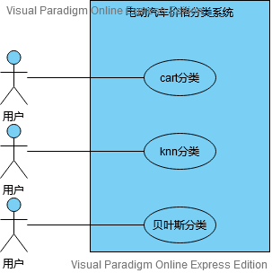

### [开发环境](doc/README.MD)

### [数据集](data/train.csv)

### [数据特征](data/tag.csv)

### 特征分析

##### feat1

##### feat2
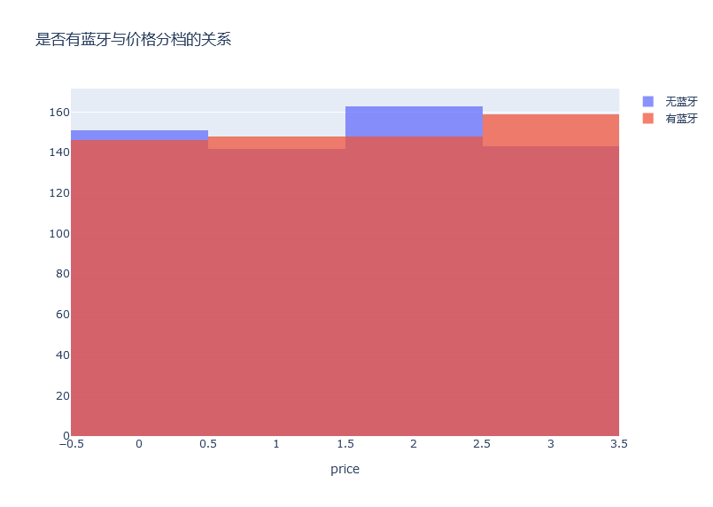
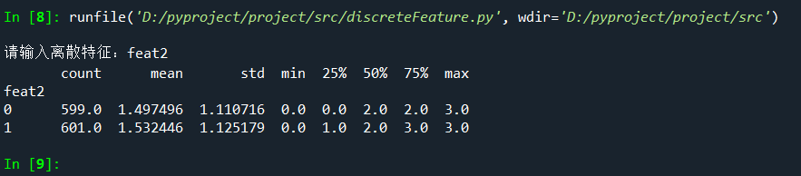

##### feat3

##### feat4
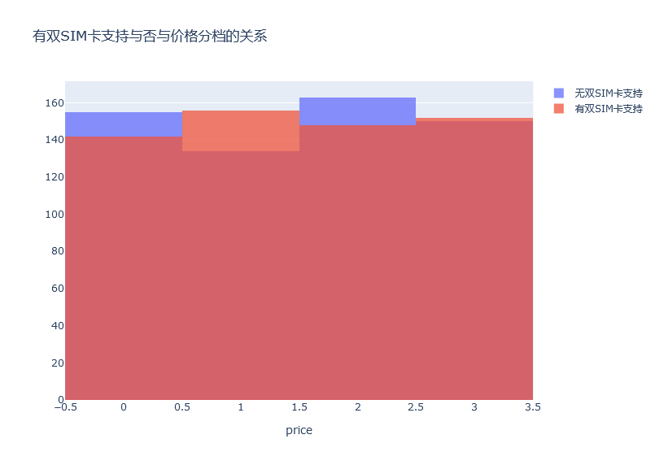

##### feat5

##### feat6
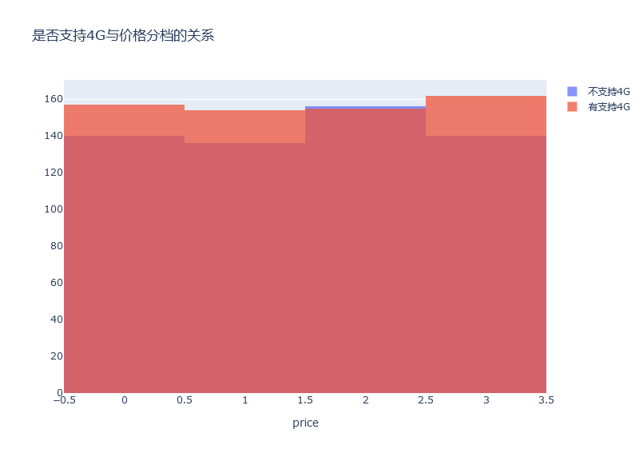

##### feat7

##### feat8

##### feat9

##### feat10
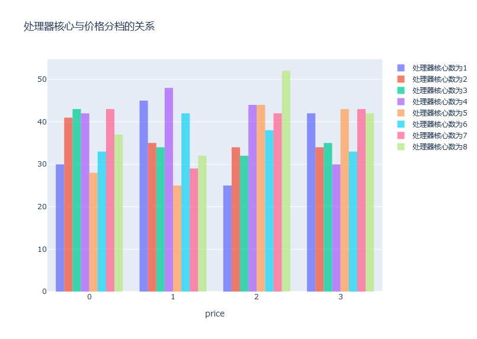
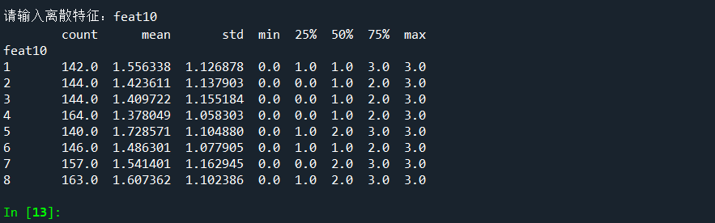

##### feat11

##### feat12

##### feat13

##### feat14

##### feat15

##### feat16

##### feat17

##### feat18
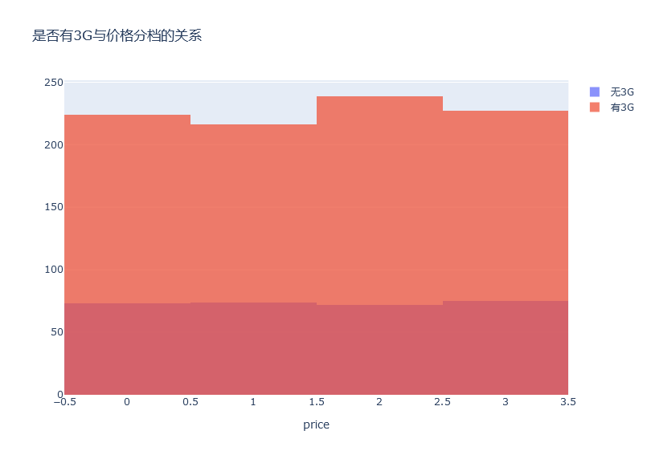
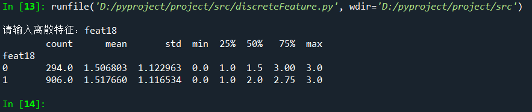

##### feat19
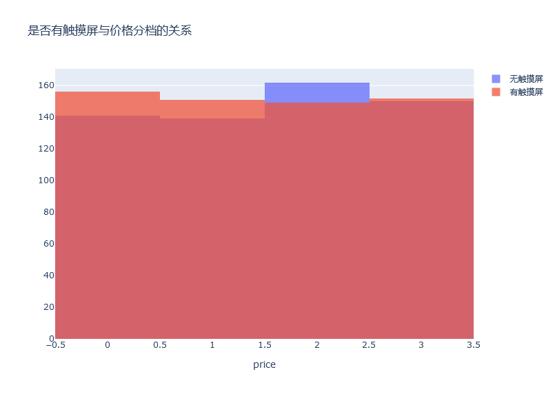
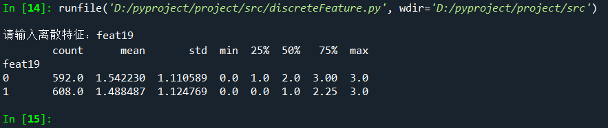

##### feat20
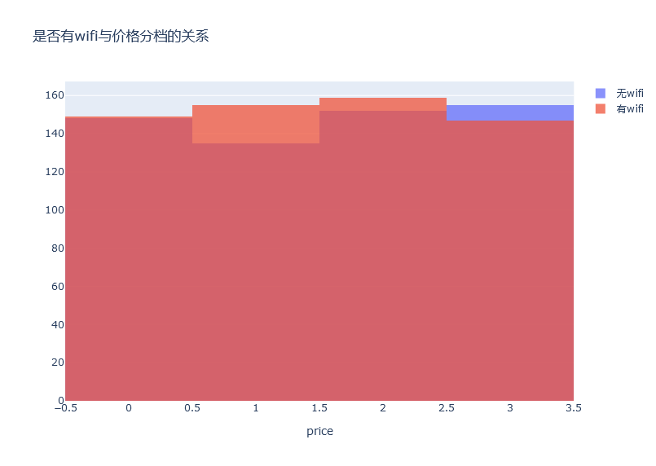
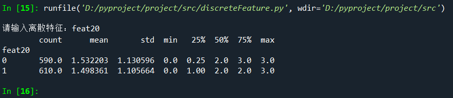

### 特征相关性分析
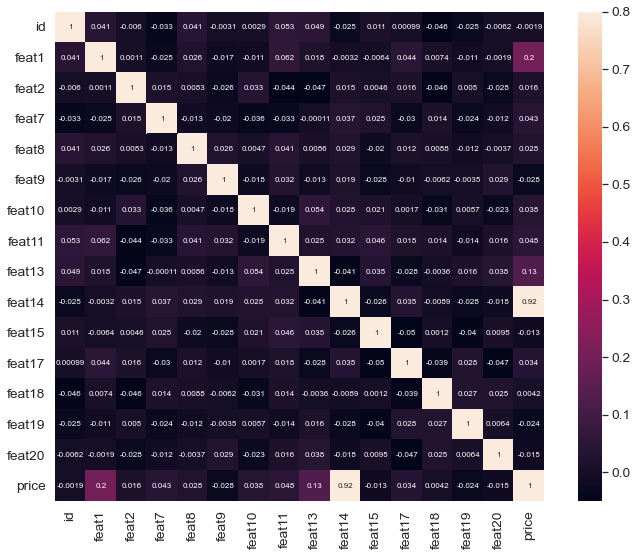

### CART决策树

