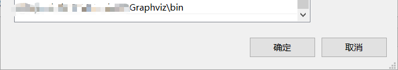

# 环境配置
[Spyder IDE](https://github.com/spyder-ide/spyder/releases) or other IDE
Python 3.8.3 64-bit(conda) or other  Python version
[Graphviz](https://www2.graphviz.org/Packages/stable/windows/10/msbuild/Release/Win32/) - Graph Visualization Software
##### Graohviz安装
需设置设置系统环境变量path为解压目录

##### 其它
当遇到诸如：

需安装响应的module
eg：
```cmd/sh
pip install pandas
pip install pydotplus
```


